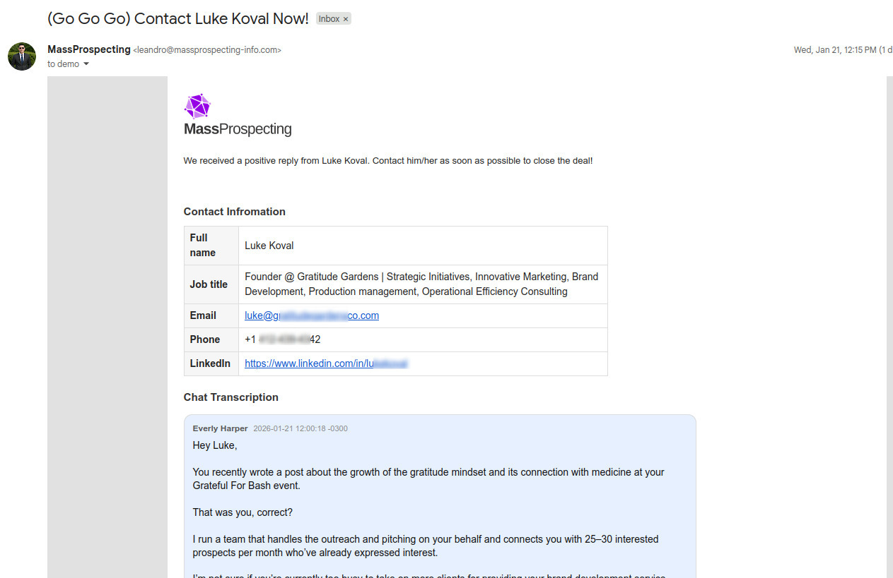

# ConnectionSphere

## TL;DR 

**ConnectionSphere** guarantees 25-30 warm leads every month. Outreach starts immediately after signup — no tech, no setup required. Just conversations delivered directly to your inbox.

## What is ConnectionSphere?

**ConnectionSphere** is an **AI-powered** and **done-for-you** lead generation and **outreach platform**.

**ConnectionSphere** automatically **discovers**, **enriches**, and **engages** high-intent prospects with minimal effort. 

The system continuously analyzes public activity to detect relevant **talk signals** and find opportunities based on user-defined **targeting criteria** such as role, industry, and location.

**ConnectionSphere** identifies matching prospects, enriches them with verified contact data (email, phone, company information), and applies AI to generate highly personalized outreach messages grounded in real, recent activity. This approach enables more natural conversations and significantly higher response rates compared to generic cold outreach.

The platform operates on a credit-based model, where credits are consumed per **positive response**. All technical complexity — including data extraction, enrichment, and verification — is handled by **ConnectionSphere**, requiring no software installation, account connections, or manual setup from the user.

**ConnectionSphere** is built for founders, sales teams, and agencies seeking consistent, context-aware lead flow while preserving account safety and reducing operational overhead.

## In plain English....

Each time we find a lead who is interested in your offer, ...

... you will receive an email notification like this, with 
the contact information of the lead and the full transcription 
of our conversation with him/her.

