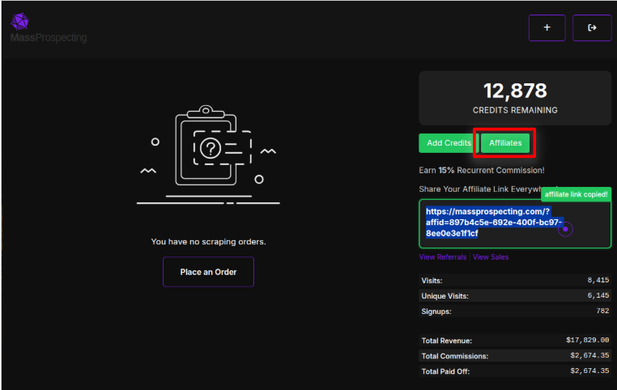
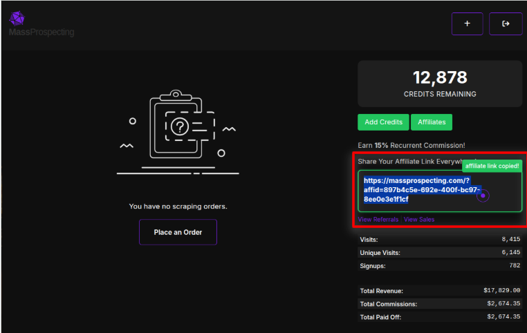
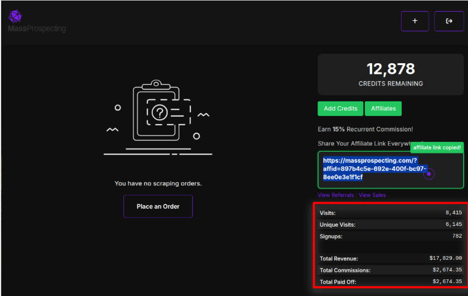

# Affiliates Program

Want to earn passive income while spreading the word about ConnectionSphere?

Join our affiliate program and earn a 15% recurring commission for every customer you refer — for life.

---

## 💰 How It Works

- You get a unique referral link
- Share it via email, social media, blog, or DM
- Anyone who signs up through your link is permanently tagged to your account
- You earn 15% of all their future payments, forever

---

## 🔗 Where to Find Your Link

From the main dashboard, click the “Affiliates” button:

Your personal affiliate link will be shown and copied instantly when you click on it.

Paste it anywhere: LinkedIn DMs, Twitter threads, newsletters, Facebook groups — anywhere your audience lives.

---

## 📊 Track Your Performance

You’ll also see a live breakdown of your affiliate performance:

| Metric                | Description |
|-----------------------|-------------|
| Visits                | Total clicks on your link |
| Unique Visits         | Number of unique people who clicked |
| Signups               | Number of users who signed up |
| Total Revenue         | Revenue generated by your referrals |
| Total Commissions     | Your 15% share of that revenue |
| Total Paid Off        | Amount that has been paid to your PayPal account |

---

## 🧾 Payouts

- Payouts are made monthly
- You’ll be contacted by support for your PayPal or payment method
- There’s no minimum threshold — we pay everything earned

---

## Tips for Maximizing Commissions

- 🎯 Target cold email agencies, closers, and prospecting freelancers
- 📽️ Share your experience in a short Loom or Tweet
- 🧠 Create a quick-use guide to help others succeed with ConnectionSphere

Earn while helping others grow their outreach.

Let’s grow — together.
