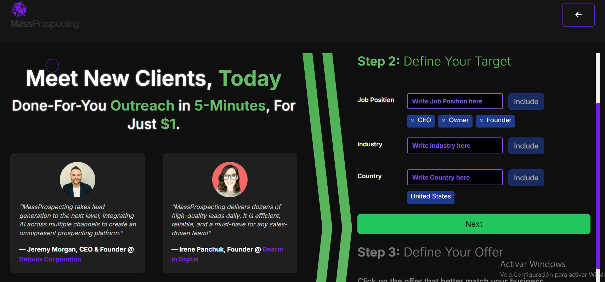
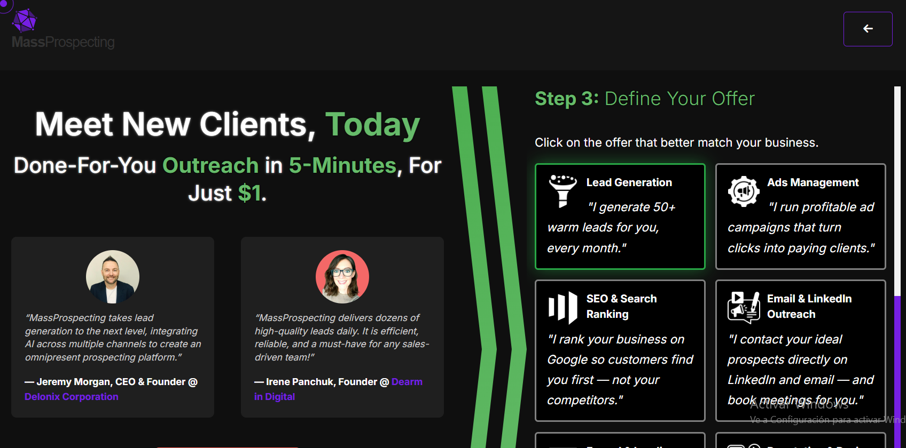

# Creating a New Campaign

Setting up a new campaign is quick and easy with ConnectionSphere.

---

## Steps

1. Go to [connectionsphere.com/app/agency/new](https://connectionsphere.com/app/agency/new).  

2. **Step 2: Define Your Target**  
   - Enter the job positions you want to target (e.g., CEO, Owner, Founder).  
   - Specify the industry and country for your outreach.  
   - Click the **Next** button to proceed.  

   

3. **Step 3: Define Your Offer**  
   - Select the offer that best matches your business goals. Options include:  
     - **Lead Generation**: "I generate 50+ warm leads for you, every month."  
     - **Ads Management**: "I run profitable ad campaigns that turn clicks into paying clients."  
     - **SEO & Search Ranking**: "I rank your business on Google so customers find you first — not your competitors."  
     - **Email & LinkedIn Outreach**: "I contact your ideal prospects directly on LinkedIn and email — and book meetings for you."  

   

---

## What Happens Next

- Once your campaign is set up, it will start running based on the selected target and offer.  
- You can monitor its progress in the agency dashboard.