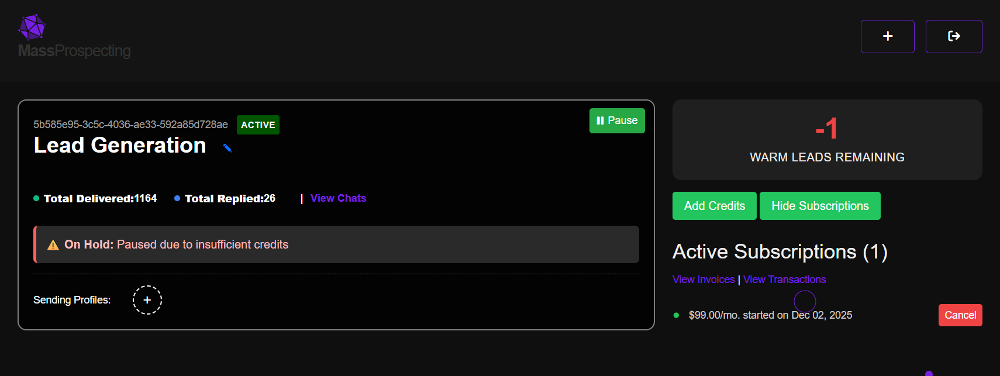

# Managing Credits

Keep track of your active subscriptions and ensure your campaigns run smoothly.

---

## Viewing Subscriptions

1. Go to the agency dashboard at [connectionsphere.com/app/agency](https://connectionsphere.com/app/agency).  
2. Locate the **Active Subscriptions** section.  
   - Here, you can view details like the subscription plan, start date, and monthly cost.

---

## Adding Credits

1. Click the **Add Credits** button.  
   - This will display the available plans and subscription options, as described in [Starting Your Trial](starting-trial.md).

---

## Resolving Insufficient Credits

1. If your campaign is paused due to insufficient credits, you will see a warning message.  
   - _Paused due to insufficient credits._

---

## Canceling Subscriptions

1. To cancel a subscription, click the **Cancel** button in the **Active Subscriptions** section.  
   - This will stop future charges and deactivate the subscription.

---

## Viewing Invoices and Transactions

1. **View Invoices**: Click the **View Invoices** link in the **Active Subscriptions** section.  
   - This will display a list of all your past invoices for subscription payments.

2. **View Transactions**: Click the **View Transactions** link in the **Active Subscriptions** section.  
   - This will provide a detailed breakdown of your credits consumption, including usage history and remaining credits.

