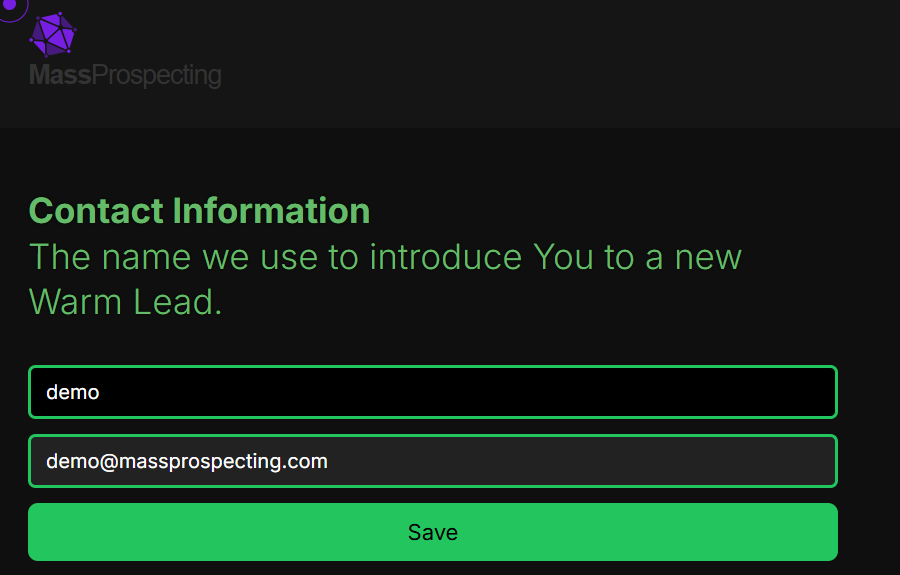

# Agency Settings

Manage your agency settings to ensure a seamless experience when introducing yourself to warm leads.

---

## Overview

The primary setting in the agency service is the **user's name**. This name is used to introduce you to warm leads when they are transferred to you. Ensuring that this information is accurate and up-to-date is essential for maintaining a professional and personalized interaction with your leads.

---

## Accessing the Settings Screen

1. Navigate to the agency dashboard at [connectionsphere.com/app/agency](https://connectionsphere.com/app/agency).  
2. Locate the **cog icon** in the top-right corner of the dashboard.  
   - Click the icon to open the settings screen.  

---

## Updating Your Name

1. On the settings screen, locate the **Contact Information** section.  
2. Enter your name in the provided field.  
   - This is the name that will be used to introduce you to warm leads.  
3. Click the **Save** button to confirm your changes.  

--- 

By keeping your name updated in the settings, you ensure that your warm leads are introduced to you with accurate and professional information.
