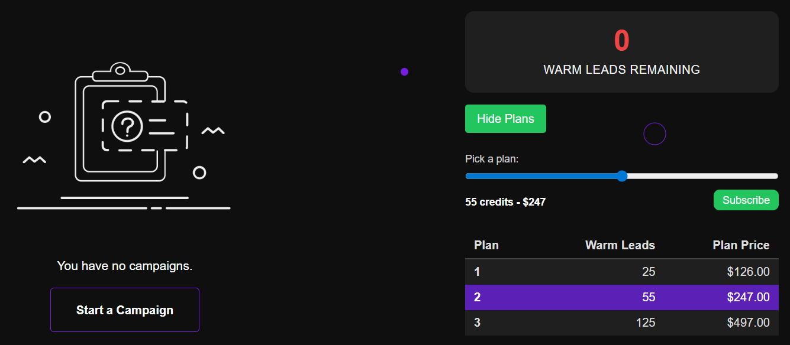

# Starting Your Trial

After [signing up](../getting-started/user-login.md) or [logging in](../getting-started/user-signup.md), you will be redirected to the agency dashboard to start your trial.

---

## Steps

1. Go to [connectionsphere.com/app/agency](https://connectionsphere.com/app/agency)  
   - You will be redirected here automatically after signup or login.

2. Pick a plan that suits your needs.  
   - Use the slider to select the number of warm leads.  
   - Plans and pricing are displayed clearly.

3. Click the **Subscribe** button.  
   - You will be redirected to PayPal to complete your transaction securely.  
   - ConnectionSphere does not store or see your credit card information.

---

## What Happens Next

- Once your payment is processed, your account will be credited with the selected number of warm leads.  
- You can immediately start your first campaign.