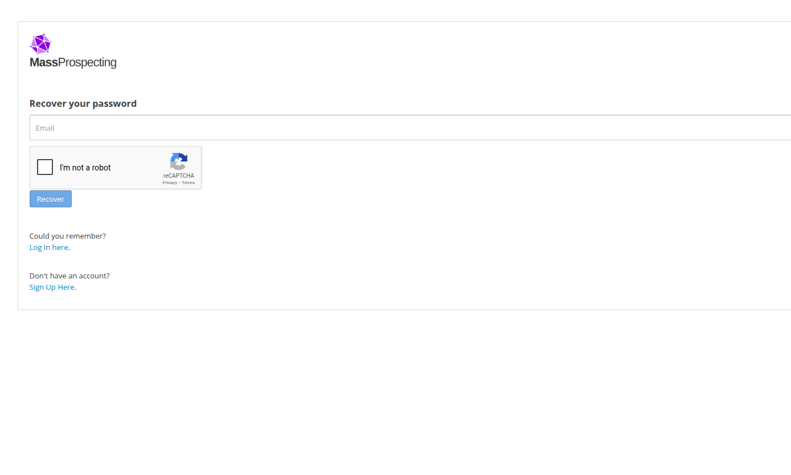
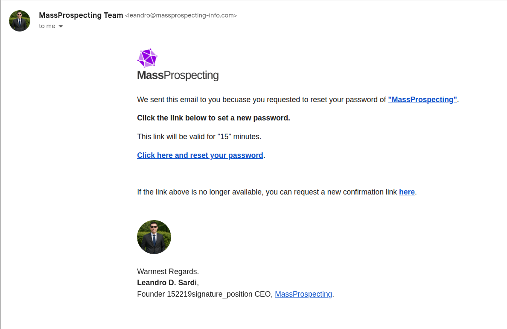
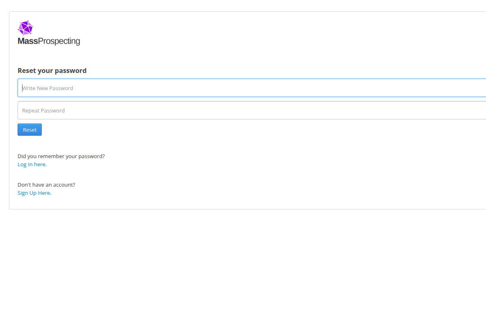

# Resetting Your Password

Follow these steps if you need to access your account from a new device or if you forgot your password.

---

## Why You Need to Reset

When you [sign up for ConnectionSphere](../getting-started/signin-up.md), you only provide your email address. Our system automatically generates a strong, random password for your account. This means **you won't know your initial password**, making password reset an essential first step to gain access to your account and secure it with a password you choose and remember.

**TL;DR:** Your initial password is randomly generated and unknown to you, so you must reset it to create one you'll actually know.

---

## Steps

1. Go to [connectionsphere.com/recover](https://connectionsphere.com/recover)  

   

2. Check your inbox for a verification email.  
   - It may take up to 5 minutes to arrive.  

3. Open the email and click on the reset link.  

   

4. Enter and confirm your new password.  

   

---

## Tips

- If you don’t see the email, check your **spam** or **promotions** folder.  
- Use a strong password to protect your account.  
