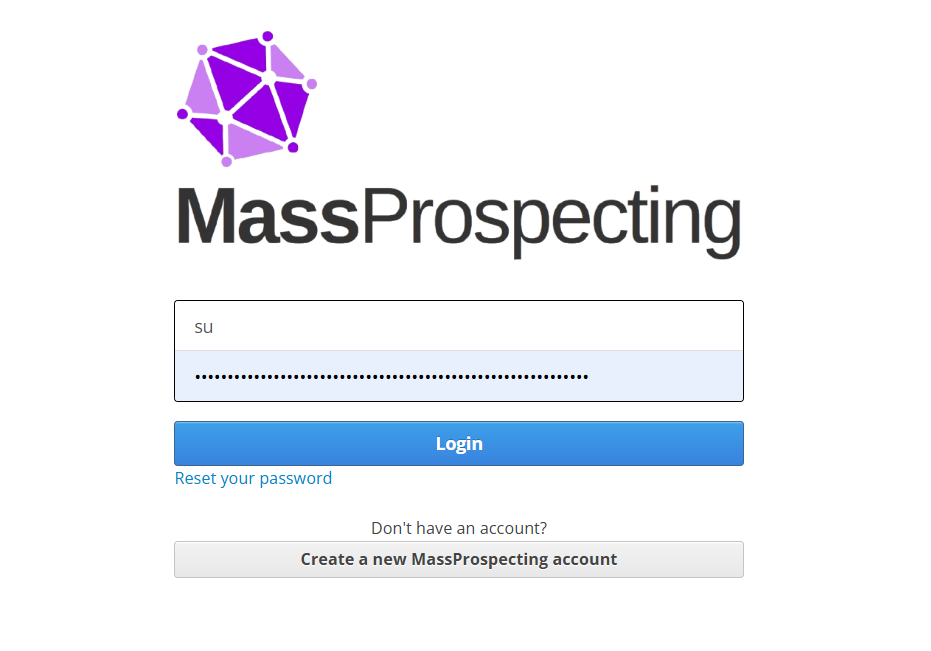

# Logging In

Accessing your ConnectionSphere account is simple and secure.

---

## Steps

1. Go to [connectionsphere.com/login](https://connectionsphere.com/login)  
2. Enter your email address and password.  
3. Click the **Login** button.  

---

## What Happens Next

- You will be logged in instantly if your credentials are correct.  
- You can start using your account immediately.  

---

## Forgot Your Password?

If you don’t remember your password, you can [reset it here](../getting-started/reset-password.md).