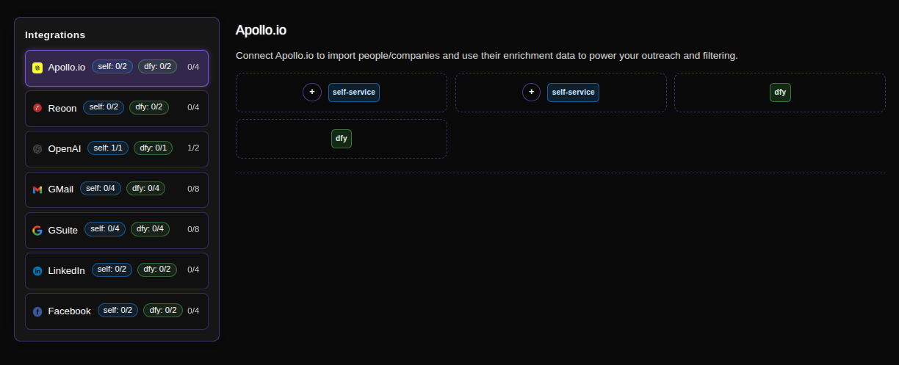
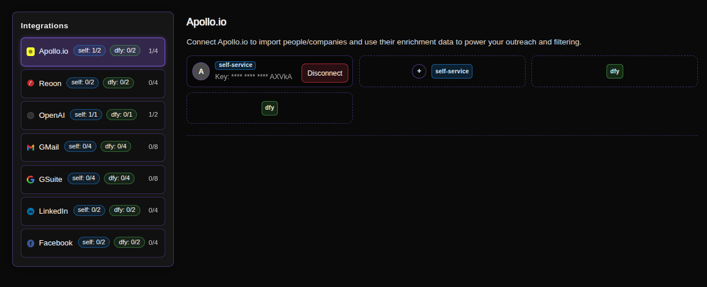
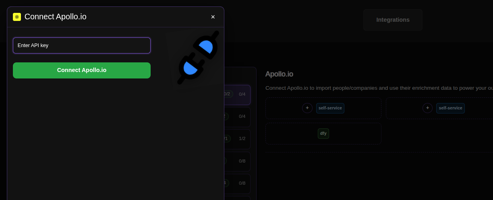

# Connecting Apollo for Lead Enrichment

Apollo.io serves as our primary data enrichment engine within ConnectionSphere. We don't use Apollo to find leads initially. Instead, we use it to *append critical contact information*—like verified email addresses, direct dial phone numbers, and other professional details—to the high-intent leads we've already identified and scraped from LinkedIn.

## Step-by-Step Connection Guide

### 1. Access the Integrations Page
Navigate to the Apollo integration page in your ConnectionSphere dashboard:
**https://connectionsphere.com/app/integrations/apollo**

### 2. Check Available Slots
On the integrations page, you'll see a list of available services, including Apollo.io. The interface shows:

*   **Self-service slots (`self`)**: Available for your own API connections (marked with dashed borders).
*   **DFY slots (`fly` or `dly`)**: Managed by the ConnectionSphere team (will be filled for you).

The notation indicates:
*   `(self: X/Y)` - Your available/used self-service slots.
*   `(fly: X/Y)` - Available/used DFY slots.
*   `X/4` - Total connections (self + DFY).

### 3. Connect Your Apollo Account
Find an available **self-service** slot (marked with a dashed border) and click the **plus button (+)** to add your API key.

### 4. Enter Your API Key

You'll be prompted to enter your Apollo API Key.

**How to Generate an Apollo Master API Key:**
1.  Log into your Apollo account at [https://app.apollo.io](https://app.apollo.io).
2.  Navigate to **Settings** -> **API**.
3.  Click **Generate New Key**.
4.  Copy the generated key and paste it into the field in ConnectionSphere.
5.  Click **Connect Apollo.io** to complete the connection.

> For detailed Apollo API documentation, visit their official guide: [Apollo API Docs](https://apolloio.github.io/apollo-api-docs/).

### 5. Maximize Enrichment Speed with Multiple Connections
If you have more than one available slot for connecting an Apollo API key, **use all of them**. This allows our system to perform multi-threaded enrichment calls, significantly speeding up the process of appending data to your scraped leads.

### 6. Managing Your Connections
To release an occupied slot (e.g., to use a new API key), simply click the **Disconnect** button on that specific slot.

## Key Benefit: From Scraped Intent to Enriched Outreach

This integration bridges a critical gap:
1.  **We Scrape:** Find high-intent leads based on signals from LinkedIn (e.g., job changes, content engagement).
2.  **Apollo Enriches:** We send those names and companies to Apollo to get missing, verified contact details.
3.  **You Outreach:** Launch personalized multi-channel campaigns with complete contact information.

## Troubleshooting

*   **API Key Issues:** Double-check that the key was copied correctly and is active.
*   **Rate Limits:** Using multiple API keys across slots helps avoid hitting individual key limits.
*   **No Enrichment:** Ensure your Apollo subscription plan includes API access and enrichment credits.

For problems with **DFY slots**, contact our support team as we manage those connections for you.