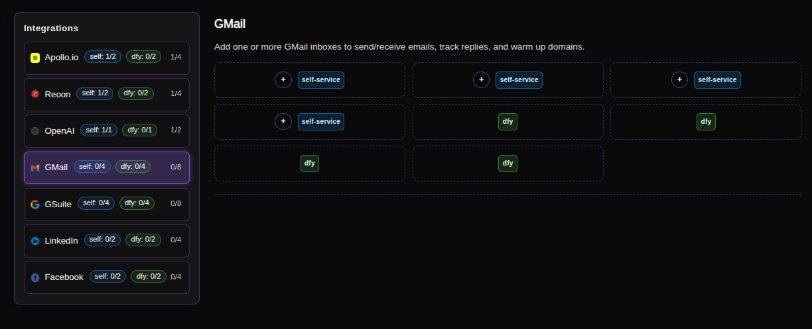
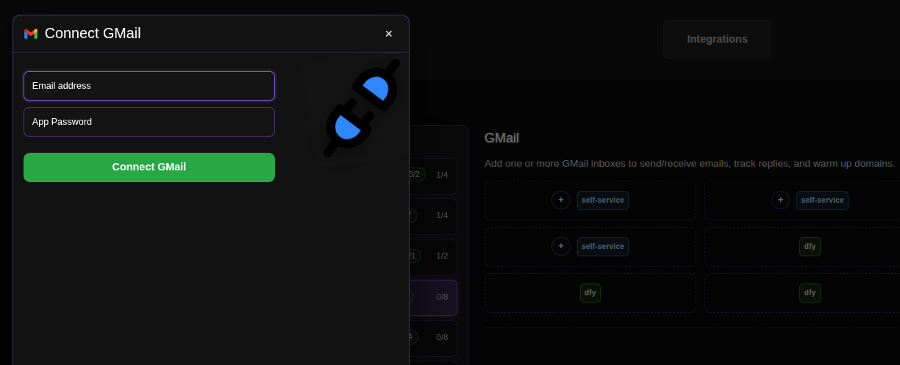

# Connecting GMail for Sending Cold Emails

GMail integration is your outreach engine. Connecting your GMail accounts allows ConnectionSphere to send personalized cold emails, track replies, and manage conversations directly from your inbox. This setup is crucial for running effective email campaigns while maintaining control over your sending domains.

## Step-by-Step Connection Guide

### 1. Access the Integrations Page
Navigate to the GMail integration page in your ConnectionSphere dashboard:
**https://connectionsphere.com/app/integrations/gmail**

### 2. Check Available Slots
On the integrations page, you'll see the status of the GMail service. The interface shows:

*   **Self-service slots (`self`)**: Available for your own email connections (marked for setup)
*   **DFY slots (`fly`)**: Managed by the ConnectionSphere team (will be filled for you)

The notation indicates:
*   `(self: X/Y)` - Your available/used self-service slots (e.g., `0/4` means 0 used, 4 available)
*   `(fly: X/Y)` - Available/used DFY slots
*   The total count shows overall connection capacity

### 3. Connect Your GMail Account
Find an available **self-service** slot and click the **plus button (+)** to add your email credentials.

### 4. Enter Your Email and App Password

You'll be prompted to enter your GMail address and an App Password (not your regular Gmail password).

**How to Generate a GMail App Password:**

1.  **Enable 2-Step Verification:**
    *   Go to your Google Account settings: [https://myaccount.google.com/security](https://myaccount.google.com/security)
    *   Under "Signing in to Google," select **2-Step Verification**
    *   Follow the steps to enable it

2.  **Generate an App Password:**
    *   Return to the Google Account security page
    *   Under "2-Step Verification," find **App passwords**
    *   Sign in again if prompted
    *   Select **Mail** as the app and **Other** as the device (you can name it "ConnectionSphere")
    *   Click **Generate**
    *   Copy the 16-character password that appears

3.  **Enable IMAP:**
    *   In Gmail, click the gear icon ⚙️ and select **See all settings**
    *   Go to the **Forwarding and POP/IMAP** tab
    *   Under "IMAP access," select **Enable IMAP**
    *   Click **Save Changes**

> For detailed Google documentation, visit: [Sign in with App Passwords](https://support.google.com/accounts/answer/185833)

### 5. Complete the Connection
Paste the 16-character App Password (not your regular Gmail password) into the ConnectionSphere field and click **Connect GMail**.

### 6. Managing Your Connections
To release an occupied slot (e.g., to remove an email account), click the **Disconnect** button associated with that specific slot.

## Key Benefits: Seamless Email Outreach

This integration enables:
*   **Direct Sending:** Send cold emails directly from your GMail accounts
*   **Reply Tracking:** Monitor and track prospect responses in real-time
*   **Domain Warm-up:** Gradually increase sending volume to maintain good deliverability
*   **Unified Dashboard:** Manage all email outreach from one platform

## Troubleshooting

*   **Authentication Errors:** Ensure you're using an App Password, not your regular Gmail password
*   **IMAP Issues:** Verify IMAP is enabled in your Gmail settings
*   **Sending Limits:** Be aware of Gmail's daily sending limits (500 recipients per day for regular accounts)

For problems with **DFY slots**, contact our support team, as we manage those connections for you.