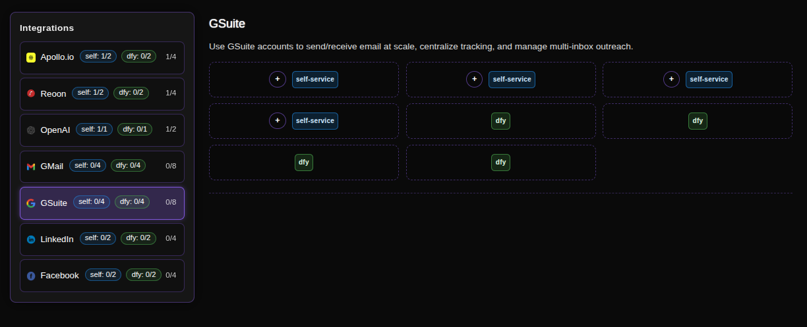
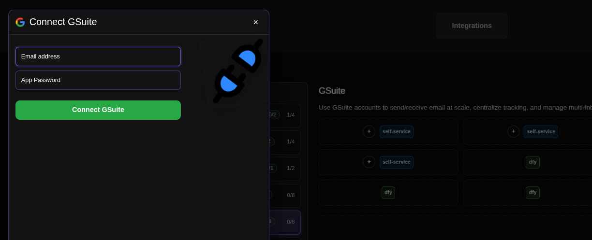

# Connecting GSuite for Sending Cold Emails

GSuite (now Google Workspace) integration is designed for scaling your outreach operations. By connecting your professional email domains, you can send cold emails at scale, centralize reply tracking, and manage multi-inbox outreach campaigns from a single dashboard while maintaining brand consistency and domain authority.

## Step-by-Step Connection Guide

### 1. Access the Integrations Page
Navigate to the GSuite integration page in your ConnectionSphere dashboard:
**https://connectionsphere.com/app/integrations/gsuite**

### 2. Check Available Slots
On the integrations page, you'll see the status of the GSuite service with available connection slots:

*   **Self-service slots (`self`)**: Available for your professional email connections
*   **DFY slots (`dy`)**: Managed by the ConnectionSphere team

The notation indicates:
*   `(self: X/Y)` - Your available/used self-service slots (typically 0/4 available when starting)
*   `(dy: X/Y)` - Available/used Done-For-You slots
*   Multiple slots allow connecting several email accounts for scaled outreach

### 3. Connect Your GSuite Account
Find an available **self-service** slot and click the **plus button (+)** to add your email credentials.

### 4. Enter Your Email and App Password

You'll be prompted to enter your GSuite (Google Workspace) email address and an App Password.

**How to Generate a GSuite App Password:**

1.  **Enable 2-Step Verification:**
    *   Go to your Google Admin console or personal Google Account settings
    *   Navigate to Security → 2-Step Verification
    *   Follow the steps to enable it for your organization or account

2.  **Generate an App Password:**
    *   Go to your Google Account security page: [https://myaccount.google.com/security](https://myaccount.google.com/security)
    *   Under "Signing in to Google," select **2-Step Verification**
    *   Scroll down to "App passwords" and click on it
    *   Select **Mail** as the app and **Other** as the device (name it "ConnectionSphere")
    *   Click **Generate**
    *   Copy the 16-character password that appears

3.  **Enable IMAP Access:**
    *   In Gmail, click the gear icon ⚙️ and select **See all settings**
    *   Go to the **Forwarding and POP/IMAP** tab
    *   Under "IMAP access," select **Enable IMAP**
    *   Click **Save Changes**

> For detailed Google Workspace documentation, visit: [Use App Passwords with Google Workspace](https://support.google.com/a/answer/9004345)

### 5. Complete the Connection
Paste the 16-character App Password into the ConnectionSphere field and click **Connect GSuite**.

### 6. Managing Your Connections
To release an occupied slot (to remove or replace an email account), click the **Disconnect** button associated with that specific slot.

## Key Benefits: Professional Email Outreach at Scale

This integration enables:
*   **Scaled Sending:** Send cold emails from multiple professional accounts simultaneously
*   **Centralized Tracking:** Monitor all outreach campaigns and replies from one platform
*   **Domain Authority:** Use your professional domains for better deliverability and trust
*   **Team Management:** Manage multiple team inboxes and sending capacities

## Best Practices

*   **Warm-up Period:** Gradually increase sending volume for new domains
*   **Multiple Accounts:** Use several slots to distribute sending load
*   **Content Variation:** Rotate different email copy across accounts
*   **Monitoring:** Regularly check domain health and reputation

## Troubleshooting

*   **Authentication Errors:** Ensure you're using an App Password, not your regular password
*   **Admin Restrictions:** For organizational accounts, verify that IMAP access is allowed by your administrator
*   **Sending Limits:** Google Workspace typically allows 2,000 recipients per day per account

For problems with **DFY slots** or enterprise setups, contact our support team for assistance.