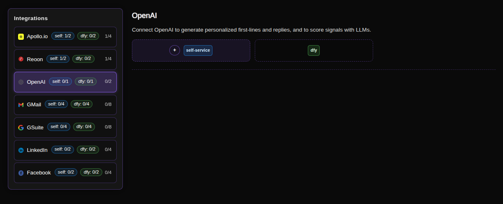
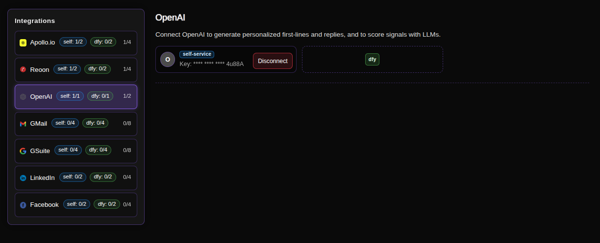
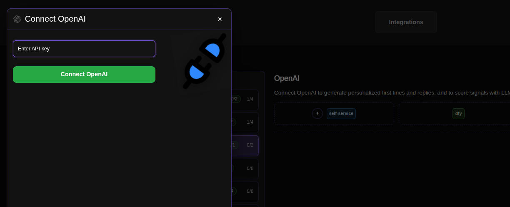

# Connecting OpenAI for Outreach Personalization

OpenAI is the brain behind your outreach. By integrating it with ConnectionSphere, you leverage advanced LLMs (Large Language Models) to generate hyper-personalized first lines and intelligent replies. It also analyzes lead signals to score and prioritize who is most likely to engage, transforming your outreach from generic blasts into meaningful, context-aware conversations.

## Step-by-Step Connection Guide

### 1. Access the Integrations Page
Navigate to the OpenAI integration page in your ConnectionSphere dashboard:
**https://connectionsphere.com/app/integrations/openai**

### 2. Check Available Slots
On the integrations page, you'll see the status of the OpenAI service. The interface shows:

*   **Self-service slots (`self`)**: Available for your own API connections.
*   **DFY slots (`dfy` or `#y`)**: Managed by the ConnectionSphere team.

The notation indicates:
*   `(self: X/Y)` - Your available/used self-service slots (e.g., `0/1` or `1/1`).
*   `(dfy: X/Y)` - Available/used DFY slots.
*   The total count shows overall connection capacity.

### 3. Connect Your OpenAI Account
Find an available **self-service** slot and click the **plus button (+)** to add your API key.

### 4. Enter Your API Key

A modal will appear prompting you to enter your OpenAI API Key.

**How to Generate an OpenAI API Key:**
1.  Go to the OpenAI platform portal: [https://platform.openai.com](https://platform.openai.com)
2.  Sign in to your account.
3.  Click on your profile icon in the top-right corner and select **View API keys**.
4.  On the API keys page, click **Create new secret key**.
5.  Copy the generated key **immediately** and paste it into the field in ConnectionSphere.
6.  Click **Connect OpenAI** to complete the connection.

> **Important:** Your API key is like a password. Store it securely and never share it publicly. For detailed OpenAI API documentation, visit their official guide: [OpenAI API Docs](https://platform.openai.com/docs/api-reference).

### 5. Managing Your Connection
To release an occupied slot (e.g., to use a new API key), click the **Disconnect** button associated with that specific slot.

## Key Benefits: AI-Powered Outreach

This integration supercharges your campaigns:
*   **Personalized First Lines:** Generate unique, context-aware opening lines for each prospect based on their profile and activity.
*   **Intelligent Reply Handling:** Craft nuanced, human-like responses to prospect replies, keeping conversations flowing.
*   **Lead Scoring:** Use AI to analyze scraped signals (like job changes or content posts) to automatically identify and prioritize the hottest leads.

## Troubleshooting

*   **API Key Issues:** Ensure the key was copied correctly and is active. Check your OpenAI account for any usage limits or issues.
*   **Billing:** Confirm your OpenAI account has a valid payment method added to process API requests.
*   **No Personalization:** Verify the integration is connected and active in your ConnectionSphere settings.

For problems with **DFY slots**, contact our support team, as we manage those connections for you.