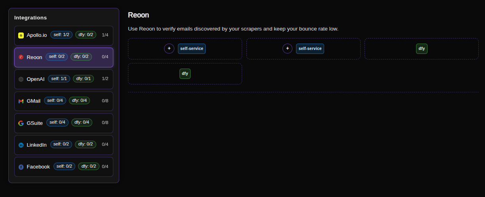
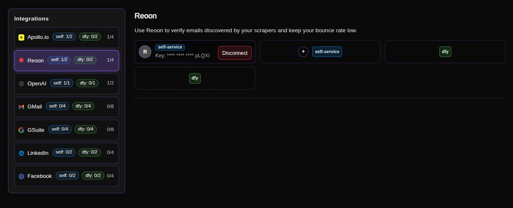
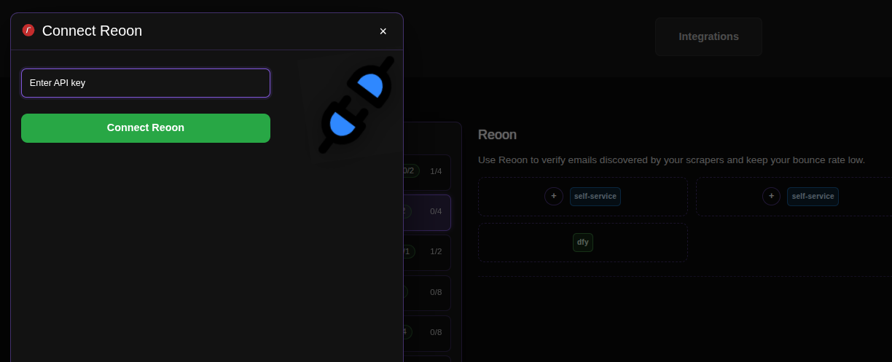

# Connecting Reoon for Email Verification

Reoon Email Verifier is our final quality control checkpoint *after* [Apollo enrichment](apollo.md) 

Once Apollo appends potential email addresses to your scraped leads, Reoon rigorously checks each one for validity and deliverability. 

This two-step process ensures you only launch email campaigns with enriched, verified, and bounce-free email addresses, protecting your sender reputation and maximizing inbox placement.

## Step-by-Step Connection Guide

### 1. Access the Integrations Page
Navigate to the Reoon integration page in your ConnectionSphere dashboard:
**https://connectionsphere.com/app/integrations/reoon**

### 2. Check Available Slots
On the integrations page, you'll see a list of available services, including Reoon. The interface shows:

*   **Self-service slots (`self`)**: Available for your own API connections.
*   **DFY slots (`dly` or `fly`)**: Managed by the ConnectionSphere team (will be filled for you).

The notation indicates:
*   `(self: X/Y)` - Your available/used self-service slots (e.g., `0/2` means 0 used, 2 available).
*   `(dly: X/Y)` - Available/used DFY slots.
*   The total count shows overall connection capacity.

### 3. Connect Your Reoon Account
Find an available **self-service** slot and click the **plus button (+)** to add your API key.

### 4. Enter Your API Key

You'll be prompted to enter your Reoon API Key in the modal that appears.

**How to Generate a Reoon API Key:**
1.  Log into your Reoon Email Verifier account at [https://app.reoon.com](https://app.reoon.com).
2.  Navigate to your **Account** or **API Settings** section.
3.  Look for the option to **Generate** or **View** your API Key.
4.  Copy the generated key and paste it into the field in ConnectionSphere.
5.  Click **Connect Reoon** to complete the connection.

> For detailed Reoon API documentation, visit their official guide: [Reoon API Documentation](https://docs.reoon.com/email-verifier-api/).

### 5. Maximize Verification Speed with Multiple Connections
If you have more than one available slot, **use all of them**. Connecting multiple API keys enables multi-threaded verification, allowing our system to validate large lists of scraped emails much faster.

### 6. Managing Your Connections
To release an occupied slot (e.g., to use a new API key or troubleshoot), click the **Disconnect** button associated with that specific slot.

## Key Benefit: Protect Your Sender Reputation

This integration is your first line of defense:
1.  **We Scrape:** Discover potential email addresses from various sources.
2.  **Reoon Verifies:** Instantly checks each email for validity, catch-all status, and other risk factors before we use it.
3.  **You Outreach Confidently:** Send campaigns knowing your list is clean and your domain reputation is safe.

## Troubleshooting

*   **API Key Issues:** Ensure the key was copied correctly and has not expired.
*   **Verification Credits:** Check your Reoon account to ensure you have sufficient verification credits.
*   **No Verification:** Confirm that your Reoon subscription plan includes API access.

For problems with **DFY slots**, contact our support team, as we manage those connections for you.