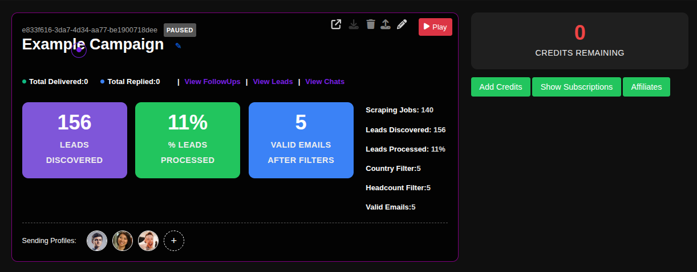
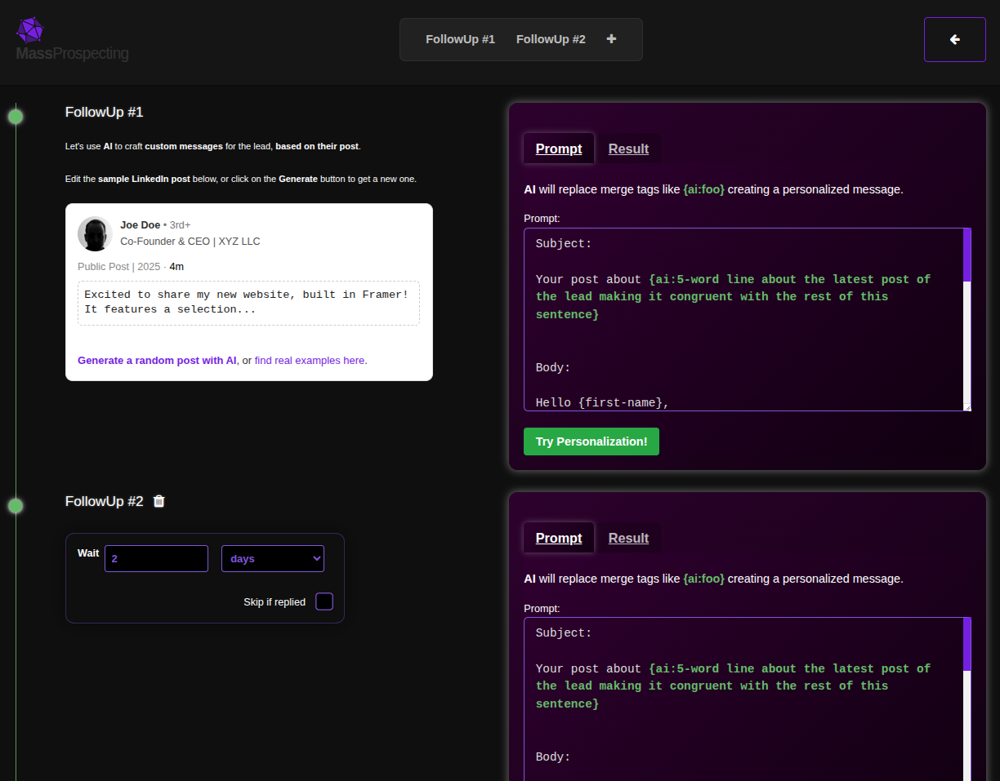

# Setting Up FollowUp Sequences

FollowUp sequences are the heart of your automated outreach campaigns. They allow you to design multi-touch message sequences that get delivered automatically, with AI-powered personalization that dramatically increases engagement and reply rates.

## Step-by-Step FollowUp Setup Guide

### 1. Access Your Campaigns
Navigate to the campaigns page in your ConnectionSphere dashboard:
**https://connectionsphere.com/app/campaigns**

### 2. Locate Your Campaign
Find the campaign you want to configure from your list of existing campaigns. Each campaign card displays key metrics like leads discovered, processing status, and delivery statistics.

### 3. Open FollowUps View
Click the **"View FollowUps"** link on your campaign card to access the message sequence configuration.

### 4. Configure Your FollowUp Sequence

The FollowUps screen allows you to build a multi-step messaging sequence:

**For Each FollowUp Message:**
- **Craft Your Message:** Write email or LinkedIn message content
- **AI Personalization:** Use `{ai:...}` merge tags for dynamic content generation
- **Delay Settings:** Set the number of days to wait before sending this followup
- **Reply Handling:** Configure whether to skip subsequent messages if the lead replies

### 5. Set Delay Between FollowUps
For each followup in your sequence, specify the wait time in days:
- **FollowUp #1:** Typically sent immediately or within 1 day
- **FollowUp #2:** Set to wait 2-4 days after the previous message
- **Additional FollowUps:** Space them 3-7 days apart for natural pacing

### 6. Configure Reply Handling
Enable **"Skip if replied"** for each followup to automatically stop sending subsequent messages when a lead responds. This prevents awkward continued outreach after engagement.

### 7. Leverage AI Personalization
Use AI merge tags like:
- `{ai:5-word line about the latest post of the lead}`
- `{ai:comment about their company recent news}`
- `{ai:personalized icebreaker based on profile}`

These tags are automatically replaced with contextually relevant content for each recipient.

## Key Benefits: Intelligent Outreach Automation

- **Multi-Touch Sequences:** Design sophisticated email/LinkedIn cadences
- **Smart Timing:** Space messages appropriately for maximum impact
- **AI-Powered Personalization:** Create hyper-relevant messages at scale
- **Reply-Responsive:** Automatically adapt to prospect engagement
- **A/B Testing:** Create multiple sequences to test what works best

## Best Practices

- **Sequence Length:** Start with 3-5 followups for new campaigns
- **Message Variety:** Mix different value propositions and formats
- **Natural Pacing:** Space messages to mimic human outreach patterns
- **Personalization Depth:** Use AI tags strategically for genuine connection
- **Testing:** Continuously test subject lines, content, and timing

## Advanced Features

- **Conditional Paths:** Create different followup paths based on lead engagement
- **Content Triggers:** Trigger specific messages based on lead behavior or profile changes
- **Multi-Channel Mix:** Combine email and LinkedIn messages in one sequence

## Troubleshooting

- **Delivery Issues:** Check that sending profiles are properly connected and warmed up
- **AI Generation Problems:** Verify OpenAI integration is active and properly configured
- **Sequence Not Sending:** Ensure leads have valid contact information and are assigned to the campaign

For assistance with advanced sequence configuration or AI personalization, contact our support team.