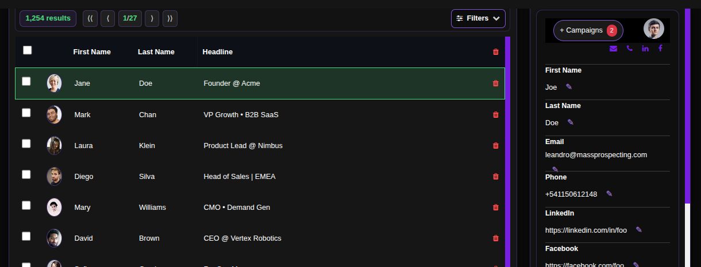
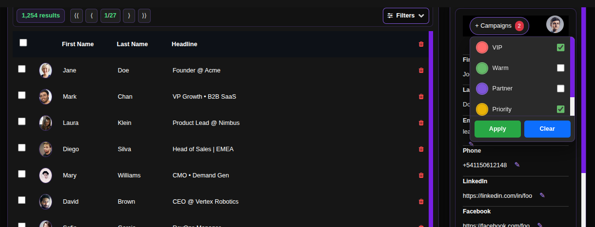

# Managing Leads

The Leads section is your central hub for managing all prospects discovered through scraping or imported into your campaigns. Here you can review, filter, edit, and organize your leads before and during outreach campaigns.

## Step-by-Step Leads Management Guide

### 1. Access Your Campaigns
Navigate to the campaigns page in your ConnectionSphere dashboard:
**https://connectionsphere.com/app/campaigns**

### 2. Locate Your Campaign
Find the campaign containing the leads you want to manage from your list of existing campaigns. Each campaign card displays key metrics like:
- Total leads discovered
- Processing completion percentage
- Valid emails found after filtering

### 3. Open Leads View
Click the **"View Leads"** link on your campaign card to access all leads associated with that campaign.

### 4. Navigate the Leads Interface

The leads screen is divided into two main panels:

**Left Panel - Leads List:**
- Displays all leads scraped or imported into the campaign
- Shows basic information: first name, last name, and headline
- Note: Presence in this list means the lead was discovered, not necessarily contacted yet

**Right Panel - Lead Details:**
- Shows comprehensive contact information when a lead is selected
- Allows editing of lead data directly in the fields
- Displays all available contact points and social profiles

### 5. Filter Your Leads

Use the **filter icon in the top-right corner** of the left panel to narrow down your leads by:
- Campaign association
- VIP status
- Job title
- Location
- Company size
- And other custom criteria

### 6. View and Edit Lead Information
Click on any lead in the left panel to view their complete details in the right panel. You can:
- Edit contact information directly
- Update job titles or company information
- Add notes or tags for segmentation
- Verify contact data accuracy

### 7. Manage Campaign Assignments

In the right panel, use the **campaigns dropdown list** to:
- See all campaigns where the lead has been scraped or reached
- Assign the lead to additional campaigns
- Remove the lead from specific campaigns
- Coordinate multi-touch outreach across different campaign sequences

## Key Benefits: Strategic Lead Management

- **Centralized Database:** All your prospects in one organized interface
- **Data Enrichment:** Edit and enhance lead information for better personalization
- **Smart Segmentation:** Use filters to create targeted lists for specific outreach
- **Cross-Campaign Management:** Assign leads to multiple sequences for layered outreach
- **Quality Control:** Verify and correct contact information before sending

## Best Practices

- **Regular Data Review:** Periodically check and update lead information
- **Strategic Filtering:** Use filters to create segments for personalized messaging
- **Campaign Coordination:** Thoughtfully assign leads to complementary campaigns
- **Data Hygiene:** Remove or update incorrect information to maintain list quality

## Troubleshooting

- **Missing Leads:** Verify that scraping jobs have completed processing
- **Filter Issues:** Check that filter criteria match your lead data format
- **Assignment Problems:** Ensure campaigns are active when assigning leads

For assistance with lead management or advanced filtering, contact our support team.