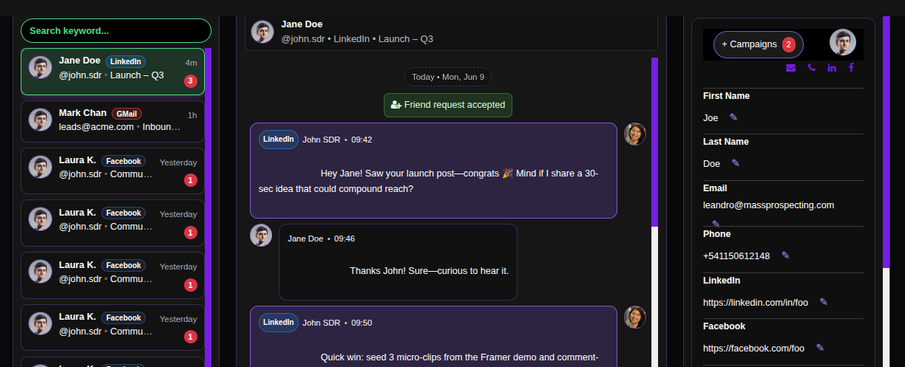

# Managing Conversations in MasterBox

MasterBox is your centralized command center for all prospect conversations. This powerful interface allows you to manage ongoing dialogues, send manual messages, update lead information, and coordinate multi-campaign outreach—all from a single, unified dashboard.

## Step-by-Step Conversation Management Guide

### 1. Access Your Campaigns
Navigate to the campaigns page in your ConnectionSphere dashboard:
**https://connectionsphere.com/app/campaigns**

### 2. Locate Your Campaign
Find the campaign containing the conversations you want to manage from your list of existing campaigns.

### 3. Open Conversations View
Click the **"View Chats"** link on your campaign card to access the MasterBox conversation interface.

### 4. Navigate the MasterBox Interface

The MasterBox is divided into three main panels:

**Left Panel - Conversations List:**
- Displays all ongoing conversations with leads
- Shows lead name, last message preview, and timestamp
- Includes status indicators and campaign tags
- Use the search bar to find specific conversations

**Central Panel - Message History:**
- Shows the complete message thread when a conversation is selected
- Display outgoing and incoming messages in chronological order
- Provides a message input field to send manual replies
- Shows message status (sent, delivered, read)

**Right Panel - Lead Information & Management:**
- Displays comprehensive lead details and profile information
- Allows editing of lead data directly in the fields
- Shows campaign assignment and management options

### 5. Manage Conversations
Click on any conversation in the left panel to:
- View the entire message history in the central panel
- Continue the dialogue by sending manual messages
- Monitor response times and engagement patterns

### 6. Send Manual Messages
In the central panel, use the message input field to:
- Send personalized follow-ups to ongoing conversations
- Respond to prospect questions or objections
- Continue automated sequences with human touchpoints
- Maintain natural, engaging dialogue flow

### 7. Update Lead Information
In the right panel, you can:
- Edit contact details, job titles, and company information
- Add notes, tags, or custom fields for better segmentation
- Update lead status based on conversation progress

### 8. Manage Campaign Assignments
In the **top-left corner of the right panel**, find the campaign management section where you can:
- See all campaigns where the lead has been scraped or reached
- Assign the lead to additional campaigns for multi-touch outreach
- Remove the lead from specific campaigns to control messaging frequency
- Coordinate cross-campaign communication strategies

## Key Benefits: Centralized Conversation Management

- **Unified Inbox:** All prospect conversations in one organized interface
- **Human Touch:** Seamlessly blend automated and manual messaging
- **Real-Time Updates:** Instant access to latest prospect interactions
- **Data Synchronization:** Keep lead information updated across all campaigns
- **Strategic Coordination:** Manage multi-campaign outreach from single dashboard

## Best Practices

- **Timely Responses:** Use MasterBox for quick follow-ups to prospect replies
- **Consistent Messaging:** Maintain tone and value proposition across automated and manual messages
- **Proactive Engagement:** Initiate conversations beyond automated sequences
- **Data Hygiene:** Update lead information based on conversation insights
- **Campaign Optimization:** Use conversation data to refine your automated sequences

## Troubleshooting

- **Missing Conversations:** Verify that leads have engaged with your messages
- **Sync Issues:** Check that all integrations are properly connected and active
- **Message Delivery Problems:** Ensure sending profiles are properly configured

For assistance with MasterBox features or advanced conversation management, contact our support team.