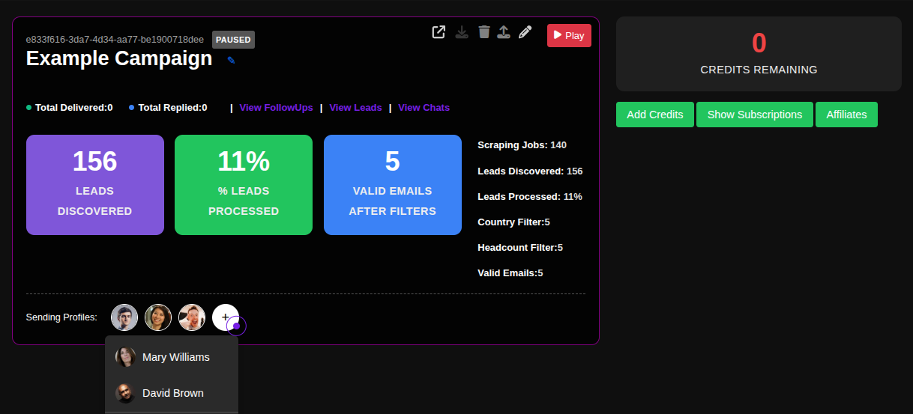
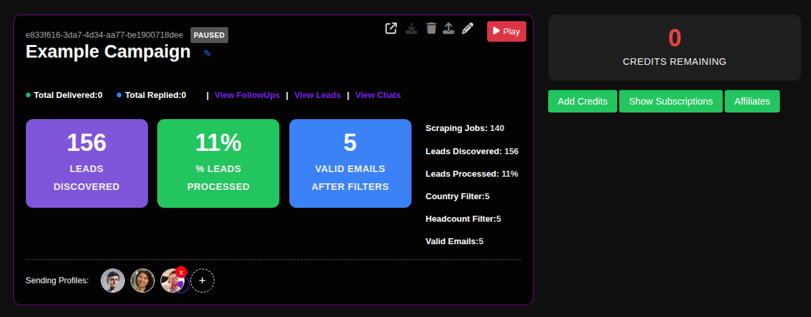

# Assigning Profiles to Campaigns

Profile assignment is a critical step in launching your outreach campaigns. By connecting sending profiles (like Gmail or LinkedIn accounts) to your campaigns, you determine which identity will be used for sending messages, ensuring consistency and proper attribution for your outreach efforts.

## Step-by-Step Profile Assignment Guide

### 1. Access Your Campaigns
Navigate to the campaigns page in your ConnectionSphere dashboard:
**https://connectionsphere.com/app/campaigns**

### 2. Locate Your Campaign
Find the campaign you want to configure from your list of existing campaigns. Each campaign card displays key metrics like leads discovered, processing status, and valid emails found.

### 3. Identify Assigned Profiles
Scroll to the bottom of your campaign card to the **"Sending Profiles"** section. Here you'll see the currently assigned profiles (e.g., "Mary Williams", "David Brown").

### 4. Add a Profile to Your Campaign
Click the **plus button (+)** next to the Sending Profiles section to assign a new profile. This will open a dropdown list where you can select from your available connected accounts (Gmail, GSuite, LinkedIn, etc.).

### 5. Remove a Profile from a Campaign
To remove a profile from a campaign, click the **red remove icon (×)** next to the profile name you wish to disconnect. This immediately stops that profile from sending further messages for this campaign.

## Key Benefits: Strategic Outreach Management

Proper profile assignment enables:
- **Identity Consistency:** Maintain a consistent sender identity across all campaign touches
- **Volume Distribution:** Spread sending volume across multiple profiles to avoid limits
- **Performance Tracking:** Measure results per profile to optimize your outreach strategy
- **Team Coordination:** Assign specific profiles to team members or specific campaign types

## Best Practices

- **Profile-Content Matching:** Ensure the profile's identity matches your campaign content and target audience
- **Gradual Scaling:** Start with 1-2 profiles and add more as you scale successful campaigns
- **Warm-up Period:** Use profiles that have been properly warmed up for better deliverability
- **Performance Monitoring:** Track reply rates and engagement per profile to identify top performers

## Troubleshooting

- **No Profiles Available:** Ensure you've connected sending accounts in the Integrations section first
- **Sending Errors:** Check that your assigned profiles are properly configured and authenticated
- **Low Delivery Rates:** Verify that profiles have been warmed up and aren't hitting sending limits

For assistance with profile configuration or campaign setup, contact our support team.