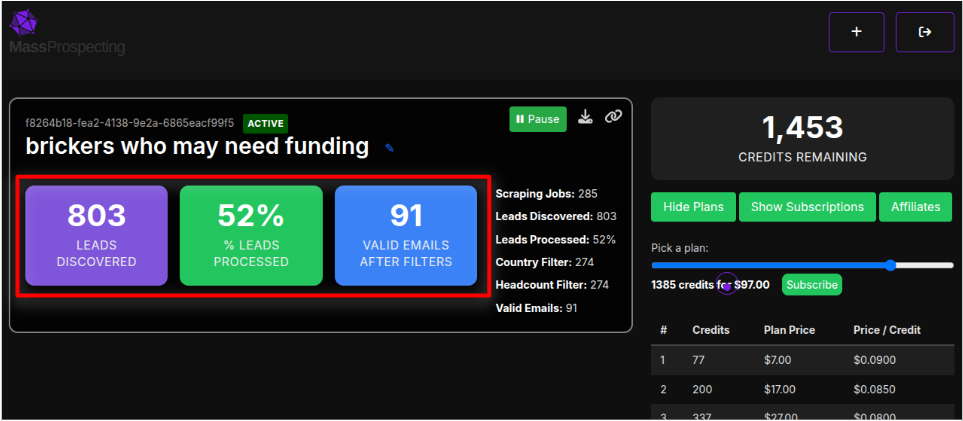
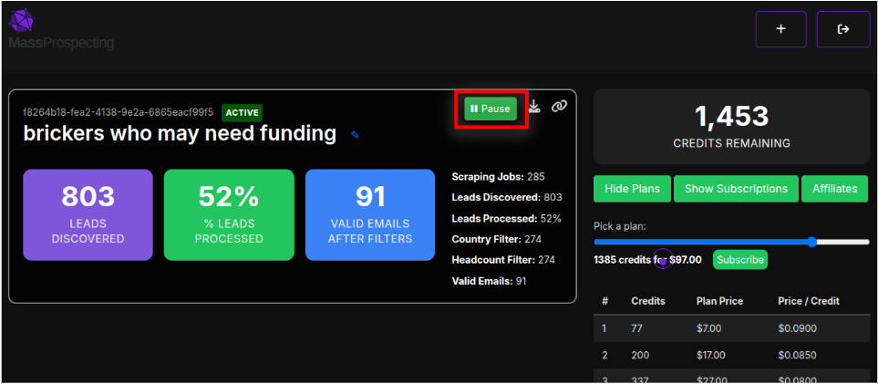
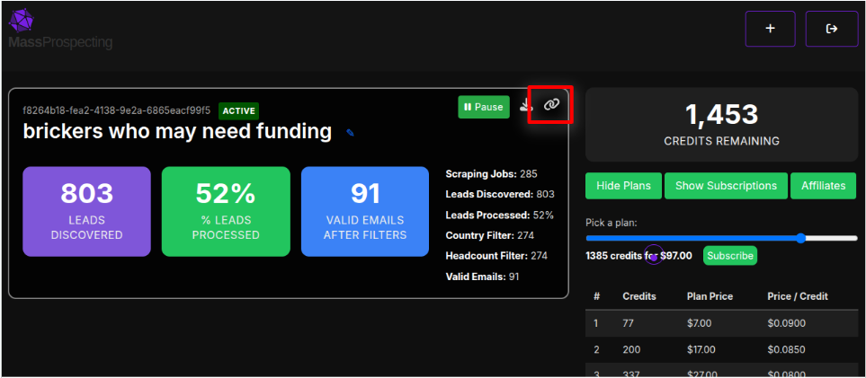

# Check Your Orders

Once you’ve placed a scraping order, you can track its performance and manage it from your dashboard.

You can check all your orders here:
[https://connectionsphere.com/app/campaigns](https://connectionsphere.com/app/campaigns)

---

## 📊 Order Statistics

Each order box shows 3 key metrics:

- 🟣 Leads Discovered: Total number of posts that showed up using your [LinkedIn search](#view-the-linkedin-search).
- 🟢 % Leads Processed: The percentage of discovered leads that have already been analyzed and enriched.
- 🔵 Valid Emails After Filters: How many of those leads had valid emails and passed your filters (e.g. country, headcount, etc).

You can use these stats to understand how well your filters are performing — and if your outreach-ready leads are increasing day by day.

---

## ⏯️ Pause or Resume an Order

You can pause or resume any scraping order anytime using the button on the top right of the order card.

This is useful if you want to conserve credits or make adjustments before continuing.

---

## Download Your Leads

Click the download icon to export all enriched leads from the order.

The CSV file includes:

- Verified email (if available)
- Direct phone number (if requested)
- Personalization merge tags
- LinkedIn profile URL
- Company, title, and more

You can upload this file into your outreach tool — or import it back into ConnectionSphere to launch campaigns.

---

## View the LinkedIn Search

The **LinkedIn search** is what you configured in the [step 1 of the new order placing](../scraping/placing-a-scraping-order.md).

Want to double-check the actual posts matched by your search?

Click the 🔗 icon to open the original LinkedIn feed query in a new tab:

---

Ready to go deeper? Continue to the next section to learn how to download and use your leads.
