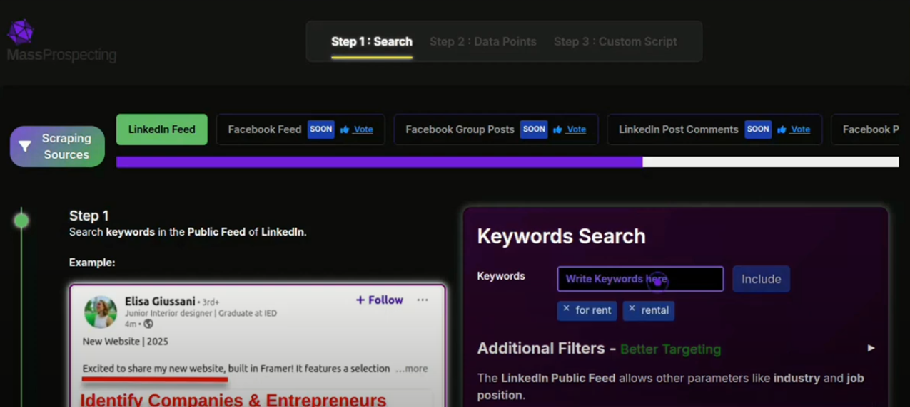
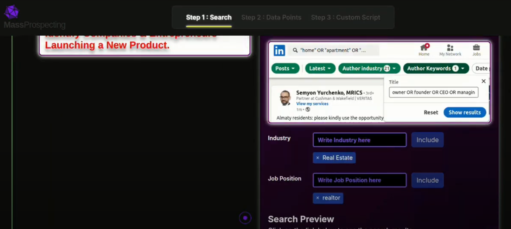
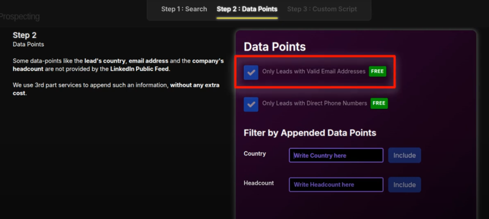
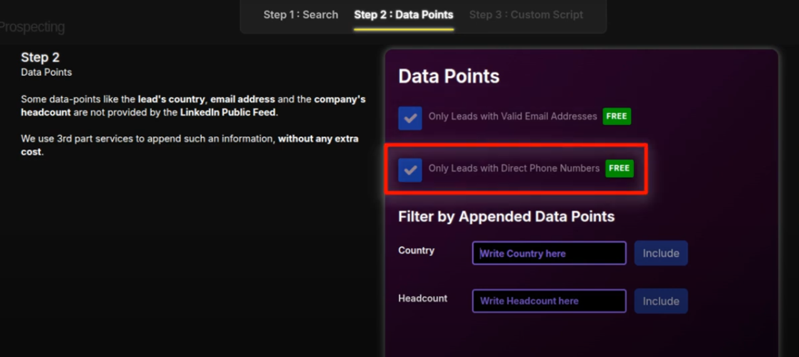
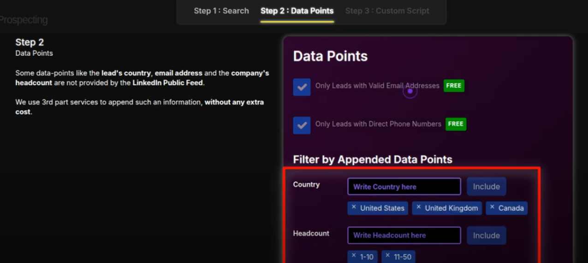
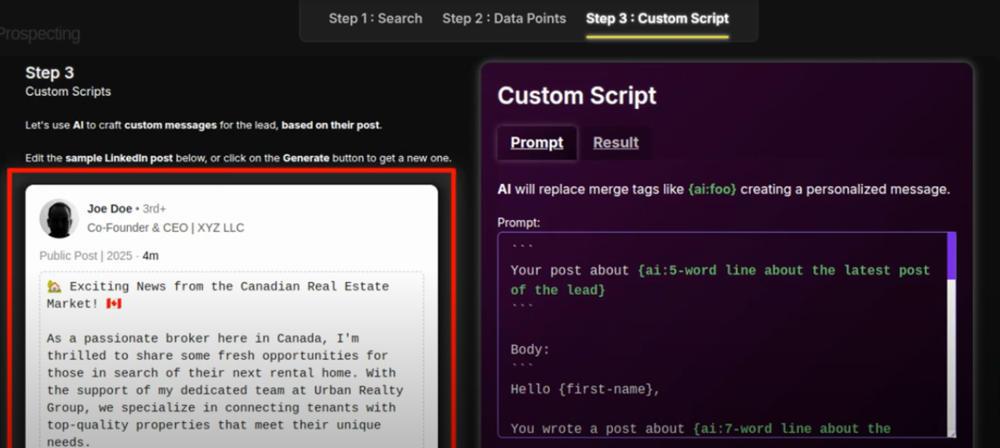
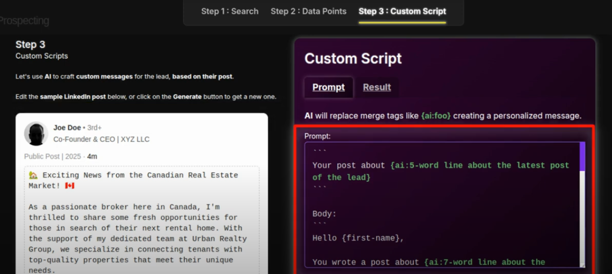

# Placing a Scraping Order

This guide will help you place your first scraping order in just a few minutes.

📺 [Watch the demo video](https://youtu.be/UzBZdIxyHB0)

---

## Overview

In ConnectionSphere, scraping orders allow you to automate lead generation by specifying the type of people and posts you want to target on LinkedIn.

You can place your scraping order here:
[https://connectionsphere.com/app/campaigns/new/linkedin-feed-signals](https://connectionsphere.com/app/campaigns/new/linkedin-feed-signals)

Placing an order involves 3 steps:

---

## Step 1 – Search for Relevant Posts

Start by entering keywords your ideal leads might post about.

For example: “for rent”, “launching a product”, “funding”, “hiring”.

You can also filter by job title and industry to better target the authors of those posts.

---

## Step 2 – Enrich with Data Points

ConnectionSphere appends extra information to each lead, such as:

- Valid Email Address ✅
- Direct Phone Number ✅
- Country & Company Headcount

Appending of verified email address has not extra cost.

Appending of direct phone nunbers will consime +2 additonal credits.

You can refine your leads with additional filters like country or company size:

---

## Step 3 – Generate a Personalized Script

Using AI, ConnectionSphere creates a message for each lead based on their actual post.

ConnectionSphere will show a sample LinkedIn post that you can use to try your AI prompt for generating a personalized message.

---

## Launch Your Order

Once your filters and message are ready, hit "Place Order".

You can [monitor it under in the campaigns screen](../scraping/check-your-orders.md).

🎯 You’re now scraping fresh leads in real time!

