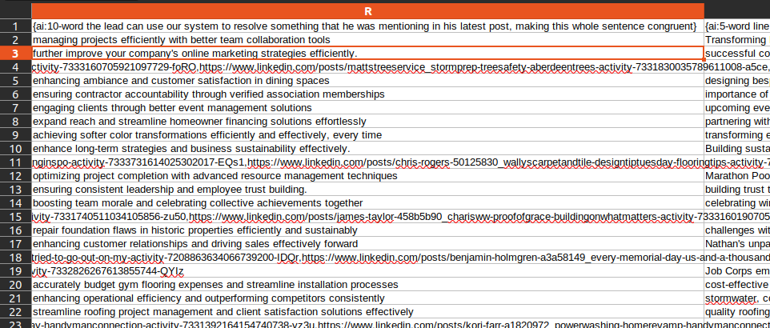

# Using Personalization

Personalization is the key to effective cold outreach.

With ConnectionSphere, each lead you scrape comes with AI-generated personalization snippets — ready to be used as merge-tags in your outreach platform.

---

## What Are Personalization Fields?

After analyzing each lead's post, ConnectionSphere generates dynamic content based on the post's content and tone.

These fields appear in the download CSV as column headers like:

| Column Name                       | Description |
|----------------------------------|-------------|
| ai:5-word line                   | Short summary of what the post is about |
| ai:7-word line                   | Slightly longer summary for use in body lines |
| ai:10-word use-case              | A sentence suggesting how your service fits their situation |
| ai:conversational-opening        | Warm intro based on the tone of the post |
| ai:closing-line                  | A helpful sentence for closing a message naturally |

📷 Example:



---

## Why Is This Powerful?

Traditional cold email relies on static templates.

With these merge tags, you can write 1 message and automatically generate hundreds of variations — one for each lead.

It keeps your outreach:
- Human
- Relevant
- Scalable

📷 Example Script:

```
Hello {first-name},  

You wrote a post about {ai:5-word line about the latest post of the lead making it congruent with the rest of this sentence}.  

It is your post... Am I right?  

I am releasing a new program where you can: 

- benefit 1,

- benefit 2,

- benefit 3,

and finally....

- benefit 4.

Would you like to try it for {ai:10-word the lead can use our system to resolve something that he was mentioning in his latest post, making this whole sentence congruent}?
```